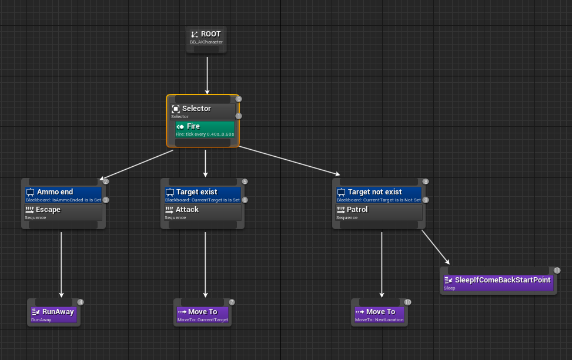

# Тестовое задание Saber Interactive

## Задание 1

Реализуйте функции сериализации и десериализации двусвязного списка, заданного следующим образом:

    class ListNode
    {
        public ListNode Prev;
        public ListNode Next;
        public ListNode Rand; // произвольный элемент внутри списка
        public string Data;
    }

    class ListRand
    {
        public ListNode Head;
        public ListNode Tail;
        public int Count;

        public void Serialize(FileStream s)
        {
        }

        public void Deserialize(FileStream s)
        {
        }
    }

## Задание 2

Составить BehaviourTree (в виде схемы) для NPC, который:
* в спокойном состоянии патрулирует территорию;
* по окончанию каждого патруля (окончанием считается возвращение в стартовую точку) NPC может или заснуть на 2 минуты или продолжить патруль;
* когда у NPC есть враг, он  атакует его, причем стрелять во врага может, только если у него есть патроны и враг на расстоянии меньше 30 метров;
* если патронов нет, то NPC убегает от врага.

#### Fire
Сервис, в котором выполняется проверка на наличие врага в поле зрения. В случае его нахождения персонаж открывает стрельбу.
Здесь же контролируется дистанция до противника.

#### Escape
Узел, в котором выполняется проверка боекомплекта в декоратое **Ammo end**. В случае их отстствия - побег. 

#### Attack
Узел, в котором выполняется сближение с противником до приемлемого расстояния.

#### Patrol
Узел, в котором проводится патрулирование. Новые точки для патрулирования актуализируются из компонента патрулирования на AICharacter. 
Условия ухода в сон контролируются в ноде **SleepIfComeBackstartPoint**.

Билд 
[link](https://drive.google.com/file/d/1CjZ5N6nUClQnUtvLFLVLFxl5x25ubQ18/view?usp=sharing)